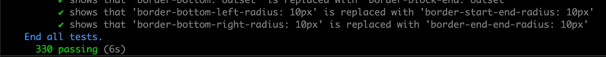
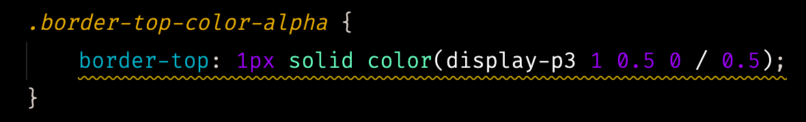

# Change Log

## 0.2.0

Code cleanup and initial testing

- Migrated to yarn v3.1.1 with [Plug'n'Play](https://yarnpkg.com/features/pnp)
  - I was able to find a way to create this extension without the `node-modules` folder.
    - Interesting notes on keeping `node_modules` as they are supported by VS Code extensions.
      - [Interesting project that came to the conclusion that node_modules was required.](https://github.com/kachkaev/njt)
        - See: [#29](https://github.com/kachkaev/njt/pull/29), [#160](https://github.com/kachkaev/njt/pull/160), and [#161](https://github.com/kachkaev/njt/pull/161)
        - See: [#131](https://github.com/DavidAnson/vscode-markdownlint/issues/131)
    - If you accidentally delete `.yarn` then delete yml file
      - <https://stackoverflow.com/a/66693677/2344083>
- Refactored code for maintainability, readability, and testing.
- Cleaned up and added additional documentation.
- Added a script to generate files for use in testing `.css` files.
- Added integration tests for `.css` files.
  - 
  - 
- Fixed a bug where the extension would not correctly calculate the start and end positions of the border physical property in some cases.
  - Before Fix:
    - 
  - After Fix:
    - 

## 0.1.11

Fix an issue related to regex matching indices not currently supported in node.js

- VSCode uses Electron
  - Electron uses node.js for local apis
    - node.js does not currently support regex matching indices (`d` flag, `hasIndices`)
- Using a polyfill
- See [#2](https://github.com/coderfin/logical-properties/issues/2)

## 0.1.10

Fixed which files diagnostics are shown for

- Previously `.git` files were showing diagnostics
- Files that were closed were still showing in `Problems`

## 0.1.9

Fixed activation

- Fixes a bug where the extension would not work on the first time it was installed
  - See [#1](https://github.com/coderfin/logical-properties/issues/1)

## 0.1.0

Initial release
