# 🧠 Logical Properties

Identify and replace CSS 💪 physical properties with 🧠 logical properties.

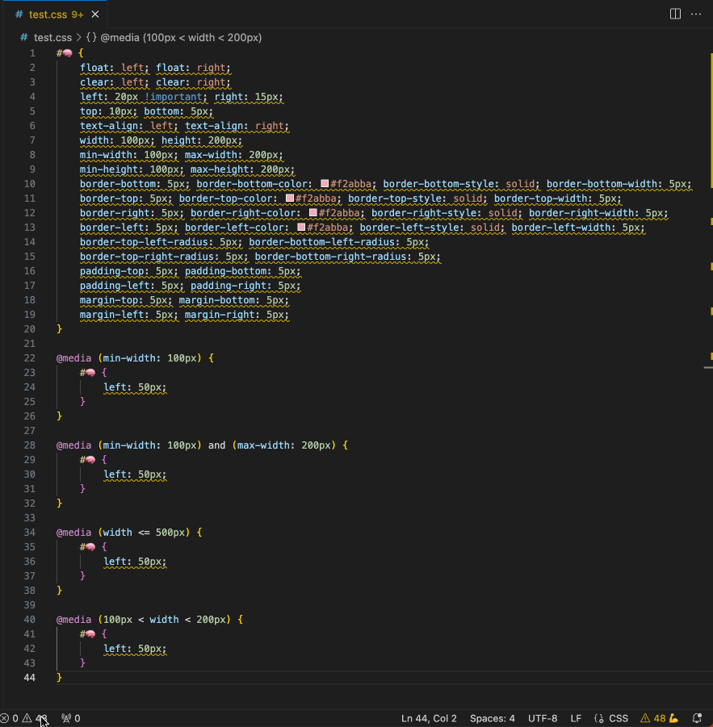

## Please leave a rating and review

<https://marketplace.visualstudio.com/items?itemName=coderfin.logical-properties&ssr=false#review-details>

## Features

This extension contributes the following:

- Command pallet - `Replace all 💪 physical properties with 🧠 logical properties.`
  - Replaces all of the detected physical properties with logical properties in the current file.
    - 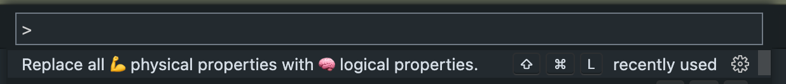
- keybindings: `ctrl+shift+L`/`cmd+shift+L`
  - Replaces all of the detected physical properties with logical properties in the current file.
  - 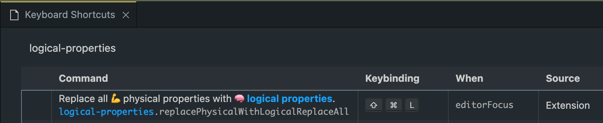
- Editor Context Menu: `Replace all 💪 physical properties with 🧠 logical properties.`
  - Replaces all of the detected physical properties with logical properties in the current file.
  - 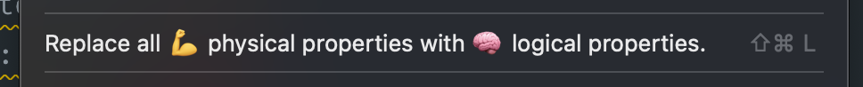
- Problems
  - Shows any warning(s) if an open file contains physical properties.
  - 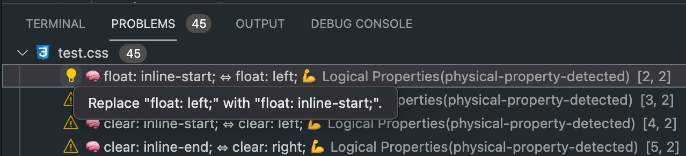
- Quick Fix/Light Bulb
  - Quickly change a single physical property to its equivalent logical property.
  - 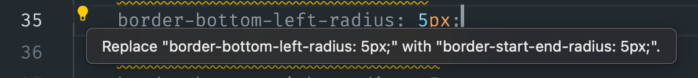
- Status Bar
  - Shows the number of physical properties detected in the current file.
    - 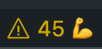
  - Indicates if no physical properties were detected in the current file.
    - 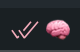
  - Click to replace all of the detected physical properties with logical properties in the current file.
- Ignore Properties
  - The `logicalProperties.ignoreProperties` configuration setting can be used to ignore specific css properties.
  - Use, for example, `"logicalProperties.ignoreProperties": ["min-width", "max-width"]` to ignore `min-width` and `max-width`.
  - 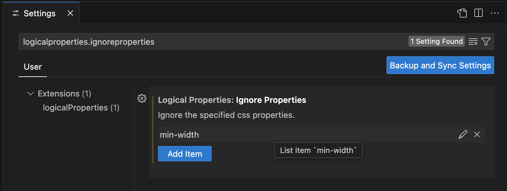
  - 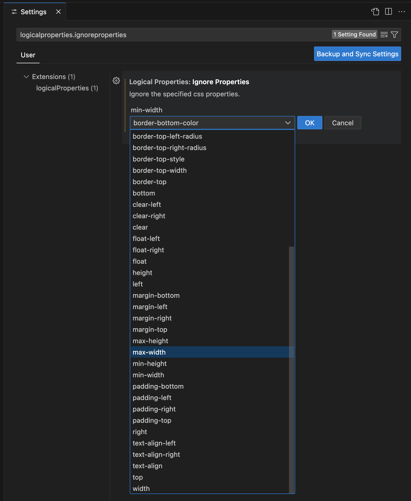
  - 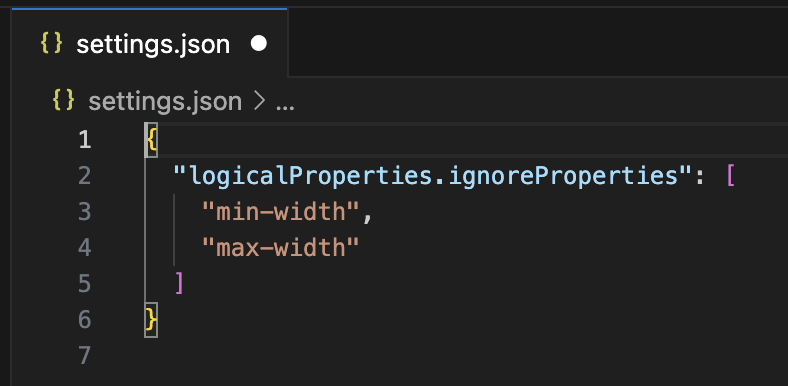
- Ignore Language IDs
  - The `logicalProperties.ignoreLanguageIds` configuration setting can be used to ignore specific files.
  - Use, for example, `"logicalProperties.ignoreLanguageIds": ["typescript"]` to ignore `Typescript` or `.ts` files.
  - 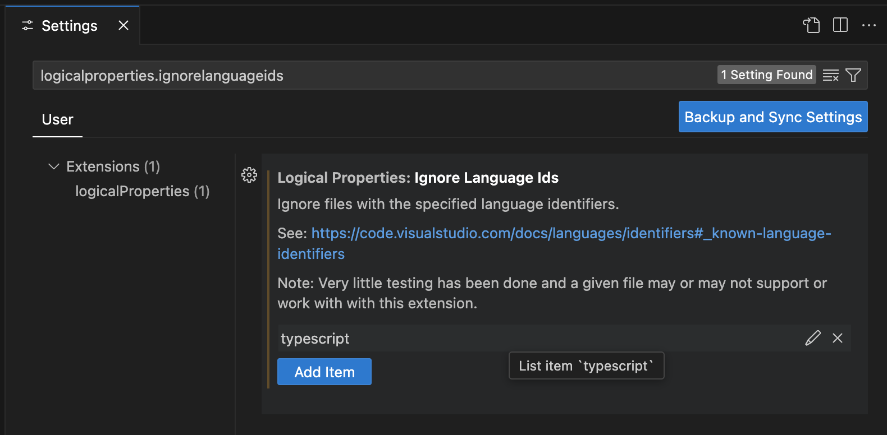
  - 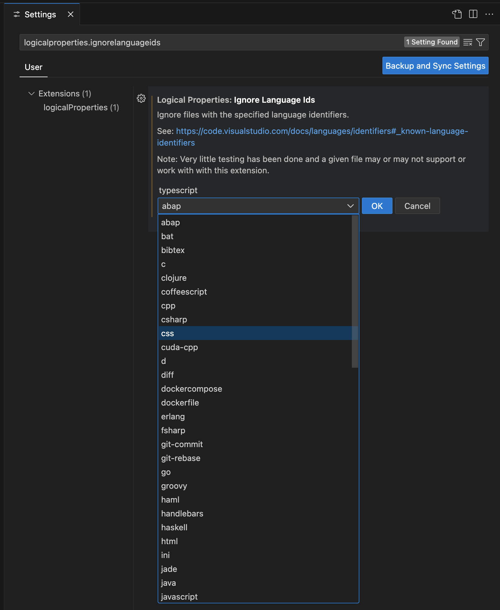
  - 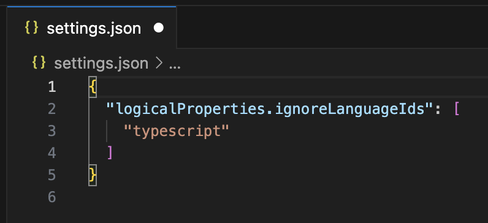
- Supported Languages
  - Testing has only been done on `.css`, `.html`, and `.jsx` files.
  - In theory the following languages are supported:
    - coffeescript
    - css
    - html
    - javascript
    - javascriptreact
    - less
    - markdown
    - php
    - plaintext
    - sass
    - scss
    - stylus
    - typescript
    - typescriptreact
    - vue
    - vue-html
    - xml
    - xsl

## Gotchas

A few things to be aware of when using this extension:

- False positives/negatives are possible.
  - For example, in an HTML file if you use an `image` tag with the `height` attribute,
    the extension will currently detect the `height` attribute as a physical property.
  - Double check your file after using the `replace all` feature.
- Changing a physical property to a logical property may or may not have an effect on styles that override styles from other files and third-party files.

## Known Issues

Limited testing of this extension has been done.

## Release Notes

## 0.1.15

- Ignore specific files
  - Added a way to ignore specific files through `ignoreLanguageIds`.
  - See: https://code.visualstudio.com/docs/languages/identifiers#_known-language-identifiers
- Renamed `ignoreList` to `ignoreProperties`.
  - `ignoreList` is now depricated and will be removed from a future version.

## 0.1.14

- Fixed the extension to no longer check for or update values within media queries.
  - Logical properties aren't supported in media queries.
    - See [#4](https://github.com/coderfin/logical-properties/issues/4)
  - Note that the check is very simple and checks for parenthesis to determine if a replacement should be made. This could lead to false positives or false negatives.
- Ignore specific CSS properties
  - Added a way to ignore specific properties through `ignoreList` (**depricated**, see: v0.1.15)
  - See [#14](https://github.com/coderfin/logical-properties/issues/14)

## 0.1.12

- Fixed `border-top-right-radius` --> `border-start-end-radius` and Fixed `border-bottom-left-radius` --> `border-end-start-radius`
- See [#7](https://github.com/coderfin/logical-properties/issues/7)
- See [#8](https://github.com/coderfin/logical-properties/issues/8)
- See [#9](https://github.com/coderfin/logical-properties/issues/9)

## 0.1.11

Fix an issue related to regex matching indices not currently supported in node.js

- VSCode uses Electron
  - Electron uses node.js for local apis
    - node.js does not currently support regex matching indices (`d` flag, `hasIndices`)
- Using a polyfill
- See [#2](https://github.com/coderfin/logical-properties/issues/2)

### 0.1.10

Fixed which files diagnostics are shown for

- Previously `.git` files were showing diagnostics
- Files that were closed were still showing in `Problems`

### 0.1.9

Fixed activation

- Fixes a bug where the extension would not work on the first time it was installed.
  - See [#1](https://github.com/coderfin/logical-properties/issues/1)

### 0.1.0

Initial release

---

#### TODO

- Update additional checks and logic for logical properties that do not map to physical properties
- Write Tests
- Link to or document basic info about logical properties
