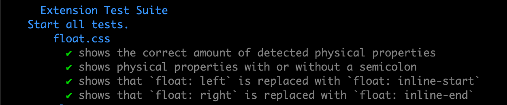
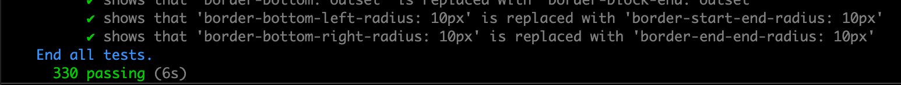
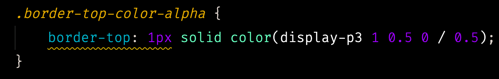
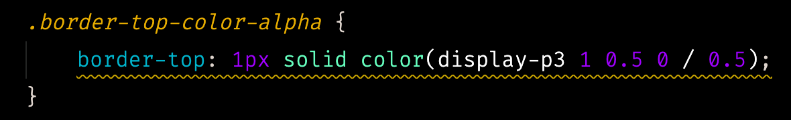

# 🧠 Logical Properties

Identify and replace CSS 💪 physical properties with 🧠 logical properties.

 

## Please consider leaving a rating and review

Although this extension is still in Preview mode if you like it and find it helpful please consider leaving a rating and review.

[Rating & Review](https://marketplace.visualstudio.com/items?itemName=coderfin.logical-properties&ssr=false#review-details)

 

## Found a bug or problem?

No worries, we would like to know about it.

Let us know on [github issues](https://github.com/coderfin/logical-properties/issues) or [open a github issue](https://github.com/coderfin/logical-properties/issues/new).

 

## Features

This extension contributes the following:

- Command pallet - `Replace all 💪 physical properties with 🧠 logical properties.`
  - Replaces all of the detected physical properties with logical properties in the current file.
    - 
- keybindings: `ctrl+shift+L`/`cmd+shift+L`
  - Replaces all of the detected physical properties with logical properties in the current file.
  - 
- Editor Context Menu: `Replace all 💪 physical properties with 🧠 logical properties.`
  - Replaces all of the detected physical properties with logical properties in the current file.
  - 
- Problems
  - Shows any warning(s) if an open file contains physical properties.
  - 
- Quick Fix/Light Bulb
  - Quickly change a single physical property to its equivalent logical property.
  - 
- Status Bar
  - Shows the number of physical properties detected in the current file.
    - 
  - Indicates if no physical properties were detected in the current file.
    - 
  - Click to replace all of the detected physical properties with logical properties in the current file.
- Supported Languages
  - In theory the following languages are or will be supported:
    - | Identifier | - | - | - | - |
      | ------------- | ------------- | ------------- | ------------- | ------------- |
      | css* | less | sass | scss | stylus |
      | html** | markdown |
      | coffeescript | javascript | typescript |
      | javascriptreact (jsx) | typescriptreact (tsx) | vue | vue-html |
      | php |
      | plaintext |
      | xml | xsl |

  - \* Thousands of integration tests have been generated and run for `.css` files.
  - ** A limited amount of manual testing has been done on `.html` files.

 

## Breaking Changes

v0.1+ --> v0.2
The way that physical properties are detected has changed.  The extension is now using `stylelint` and `css-tree` to detect properties.  Currently only CSS and HTML are supported.  Previously regular expressions were used and more file types were supported but more error prone.

## Gotchas

A few things to be aware of when using this extension:

- False positives/negatives are possible.
  - For example, in an HTML file if you use an `image` tag with the `height` attribute,
    the extension will currently detect the `height` attribute as a physical property.
  - Double check your file after using the `replace all` feature.
- Changing a physical property to a logical property may or may not have an effect on styles that override styles from other files and third-party files.

 

## Known Issues

- Currently the extension is using a `stylelint` and `css-tree` to find potential physical properties.
  - This is a breaking change from the 0.1 version that used a `"naive"` approach (a simple regular expression to find potential physical properties).
  - Physical property values can be quite complex and difficult to detect and as such these methods are not perfect and can result in false positives and negatives.
- Incomplete testing

 

## Release Notes

### 0.2.0

Code cleanup and initial testing

- Migrated to yarn v3.1.1 with [Plug'n'Play](https://yarnpkg.com/features/pnp)
  - A way was found to create this extension without the `node-modules` folder.
    - Interesting notes on keeping `node_modules` as they are supported by VS Code extensions.
      - [Interesting project that came to the conclusion that node_modules was required.](https://github.com/kachkaev/njt)
        - See: [#29](https://github.com/kachkaev/njt/pull/29), [#160](https://github.com/kachkaev/njt/pull/160), and [#161](https://github.com/kachkaev/njt/pull/161)
        - See: [#131](https://github.com/DavidAnson/vscode-markdownlint/issues/131)
    - If you accidentally delete `.yarn` then delete yml file
      - <https://stackoverflow.com/a/66693677/2344083>
- Refactored code for maintainability, readability, and testing.
- Changed how physical properties are detected from using a regular expression to using `stylelint` and `css-tree`.
- Cleaned up and added additional documentation.
- Added a script to generate files for use in testing `.css` files.
- Added integration tests for `.css` files.
  - 
  - 
- Fixed a bug where the extension would not correctly calculate the start and end positions of the border physical property in some cases.
  - Before Fix:
    - 
  - After Fix:
    - 

### 0.1.11

Fix an issue related to regex matching indices not currently supported in node.js

- VSCode uses Electron
  - Electron uses node.js for local apis
    - node.js does not currently support regex matching indices (`d` flag, `hasIndices`)
- Using a polyfill
- See [#2](https://github.com/coderfin/logical-properties/issues/2)

### 0.1.10

Fixed which files diagnostics are shown for

- Previously `.git` files were showing diagnostics
- Files that were closed were still showing in `Problems`

### 0.1.9

Fixed activation

- Fixes a bug where the extension would not work on the first time it was installed
  - See [#1](https://github.com/coderfin/logical-properties/issues/1)

### 0.1.0

Initial release

 

## What are logical properties?

[MDN Article](https://developer.mozilla.org/en-US/docs/Web/CSS/CSS_Logical_Properties)

 

### TODO

Features that are being considered and other TODOs

 

- Remove unneeded stylelint rules
- Add more supported file types
- Fix logical properties being found in media queries [#4](https://github.com/coderfin/logical-properties/issues/4)
- Continue fixing `"naive"` approach to finding physical properties.
- Update additional checks and logic for logical properties that do not map to physical properties
  - i.e. `inset-inline` and `inset-block`
- Write additional tests
  - Improve test performance
  - Divide up testing into separate sections in the testing menu
- Add option to ignore matches in comments
- Add additional commands that can be mapped to keyboard shortcuts
  - Command to jump to the previous/next match
  - Command to update all matches that are not in comments
  - etc.
- Add additional documentation on why logical properties make sense [#5](https://github.com/coderfin/logical-properties/issues/5)

  
